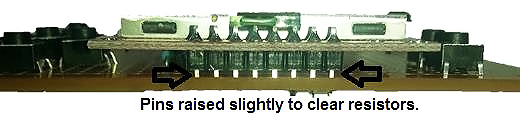
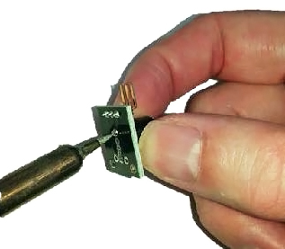
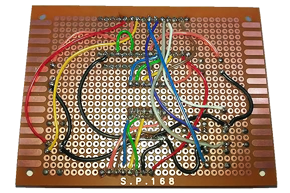

# Duinotech Game Machine

<github> View the way the project is meant to be displayed at: https://jaycar.com.au/game-machine </github>

We found a little game project online at <http://gamebuino.com>, and with it being open-source, realised we could make our own version of it using duinotech parts. Even better, there's already a heap of games that have been created at <https://github.com/Rodot/Gamebuino-Games-Compilation>, and because it's based on Arduino, you can create your own games as well. There's a complete set of libraries for making your own games at <https://github.com/Rodot/Gamebuino>, too. And just to make sure you've got something to get started with, we've built a Tic-Tac-Toe game for it too.

<iframe width="560" height="315" src="https://www.youtube.com/embed/MAlvncscQzo" frameborder="0" allow="accelerometer; autoplay; encrypted-media; gyroscope; picture-in-picture" allowfullscreen></iframe>

There's a bit of soldering and fiddly wiring involved, but we were playing games on it within a few hours.

## Table of contents

- [Duinotech Game Machine](#Duinotech-Game-Machine)
  - [Table of contents](#Table-of-contents)
  - [Bill of Materials](#Bill-of-Materials)
  - [Electrical Connections](#Electrical-Connections)
  - [Software Libraries](#Software-Libraries)
  - [Assembly](#Assembly)
    - [Soldering the Connections](#Soldering-the-Connections)
  - [Programming](#Programming)
  - [Use](#Use)
    - [More games](#More-games)
  - [Future Improvements](#Future-Improvements)

## Bill of Materials

| Qty | Code                                    | Description             |
| --- | --------------------------------------- | ----------------------- |
| 1   | [XC4414](http://jaycar.com.au/p/XC4414) | Arduino Nano board      |
| 1   | [XC4616](http://jaycar.com.au/p/XC4616) | 84x48 LCD nokia display |
| 1   | [XC4424](http://jaycar.com.au/p/XC4424) | buzzer module           |
| 7   | [SP0601](http://jaycar.com.au/p/SP0601) | micro button            |
| 1   | [HP9550](http://jaycar.com.au/p/HP9550) | prototyping board       |
| 1   | [RR0596](http://jaycar.com.au/p/RR0596) | 10k resistor pack       |
| 1   | [RR0588](http://jaycar.com.au/p/RR0588) | 4k7 resistor pack       |
| 1   | [WM4516](http://jaycar.com.au/p/WM4516) | rainbow ribbon cable    |
| 1   | [HM3211](http://jaycar.com.au/p/HM3211) | header strip            |

## Electrical Connections

| Nano | Game Machine                                | Colour used in diagrams |
| ---- | ------------------------------------------- | ----------------------- |
| 3.3V | Screen VCC direct connection                | Red                     |
| GND  | To all buttons, Screen GND, Buzzer negative | Black                   |
| D13  | Screen SCLK via divider                     | Orange                  |
| D11  | Screen DN(MOSI) via divider                 | Brown                   |
| D9   | Button 0 (Up) direct connection             | White                   |
| D8   | Button 3 (Left) direct connection           | Grey                    |
| D7   | Button 1 (Right) direct connection          | Purple                  |
| D6   | Button 2 (Down) direct connection           | Blue                    |
| D4   | Button A direct connection                  | Yellow                  |
| D3   | Buzzer positive direct connection           | Orange                  |
| D2   | Button B direct connection                  | Red                     |
| A6   | (connect to 5V for battery monitor)         | Green                   |
| A3   | Button C direct connection                  | Orange                  |
| A2   | Screen D/C via divider                      | Blue                    |
| A1   | Screen SCE via divider                      | Green                   |
| A0   | Screen RST via divider                      | Yellow                  |

## Software Libraries

| Library   | Author |
| --------- | ------ |
| Gamebuino | Rodot  |

## Assembly

You'll notice that the Prototype Board has numbers and letters marked on the columns and rows- we need to line up the components with the coordinates given so that we can fit them all in. We'll fit all the components first, then join them together with wires later.

Insert the Pushbuttons as follows:

Note that the buttons on the left should their legs running along the lettered columns (left to right)

| Button | Rows      | Columns |
| ------ | --------- | ------- |
| UP     | 24 and 27 | P and R |
| DOWN   | 24 and 27 | V and X |
| LEFT   | 27 and 30 | S and U |
| RIGHT  | 21 and 24 | S and U |
| C      | 24 and 27 | H and J |

Buttons on the right should have their legs running along the numbered rows (up and down).

| Button | Rows    | Columns |
| ------ | ------- | ------- |
| A      | 1 and 3 | V and Y |
| B      | 1 and 3 | R and U |

Make sure the buttons are pushed down firmly against the Prototype Board, and then solder them down. Take six of the 4.7kOhm resistors and for each of rows 13-18, put a resistor from column L to column P, and solder them down and trim the legs. Then take six of the 10kOhm resistors and for the same rows, put a resistor from column Q to column T. Before cutting the legs off, join all of the resistor legs on column T together by bending one of the legs over and soldering. Also join each pair of resistors by soldering the legs in column P to the leg in the same row to the leg in column Q, and then trim the excess.

After the buttons and resistors are installed, the board should look like this:

_Note the leg positions of the switches_

_Note the joins along column T and between P and Q_

Next, take the Header Strip, and break off a row of eight pins. Place this in Column I, rows 9-16, and then fit the LCD Screen into Column Y, rows 9-16. The header pins should go into the holes in the top of the LCD Screen. Solder these pieces down, leaving a small gap between the resistors and the LCD Screen so they don't touch.

Note that the top of the screen has a broad silver border. After this, you can trim the pins at the back of the LCD Screen so they aren't so long.

The next step is to fit the Nano onto the board. This goes into columns A and G, from row eight to row 22, with the USB connector facing above the side of the board with five buttons. The Nano can be pushed down firmly onto the board and soldered into place.

The final component on the front side of the board is the Buzzer. For this, we remove the Buzzer unit from the module, so that we can make our final board as compact as possible. The can be done by applying heat from a soldering iron to each of the legs (you may need to go back and forth between the legs a few times) while slowly pushing the Buzzer off the board. Be careful that it doesn't fly off as the last of the solder gives way.

The Buzzer unit can now be installed on the board- the positive pin goes to hole I1, and the negative pin to L1. You will probably need to pull the sticker off the Buzzer to see the markings, and usually, only the positive pin is marked. From the front, our Arduino Game Machine should look complete:

The wiring on the back is what makes it all work, so this has to be right. The LCD Screen runs off 3.3V power and logic levels, which is why we have the resistors on the board- they form a voltage divider, which turns 5V signals into 3.3V signals. In the table below, some of the connections are made directly, and some are made via the voltage divider.

While doing this, I've found it helpful to have this diagram of the underside of a Nano, with pins marked. It's how the Nano pins are laid out on the wiring side of the board:

### Soldering the Connections

We'll show how we did the wiring below. Firstly, make all the ground connections. We did this by running a wire from the Nano GND to the voltage divider T column, and then making all the other connections from there.

Note that in the red circles, the black wire goes to terminals on two switches, which simplifies our wiring a bit more. The next step is to make all the LCD Screen connections- here you can see how the voltage divider works. The wires from the Nano go to the resistors on column L, and come out from the resistors on column P/Q to their designated connections on the LCD Screen. Note for the LCD Screen there are five voltage divider connections and one red wire going straight to the 3.3V supply on the Nano.

Then we can do the wiring for the buttons, speaker and battery monitor. Make sure that you use the same terminals on the Push Buttons as shown- some of the terminals are wires straight through and the Nano will think the buttons are pushed down permanently if they are wired wrong.

This completes the wiring of the Game Machine

## Programming

To compile your own sketches for the Arduino Game Machine, you can use the Gamebuino libraries. This can be installed by the Library Manager in Arduino by clicking `Sketch > Include Library > Manage Libraries` and searching for _gamebuino_.

If this doesn't work, the library can also be downloaded from here: <https://github.com/Rodot/Gamebuino>. The library includes a few examples, but not any games.

You'll need to have this library installed for the Tic-Tac-Toe game to work, and also copy the `TICTACTOEforArduinoGameMachine` sketch folder from the `TICTACTOEforArduinoGameMachine.zip` file to your Arduino sketch folder.

After this, it should simply be a case of selecting the Nano board and correct COM port and pressing `upload`. You should get a chime sound as well as the above left graphic when the sketch is correctly uploaded.

If the sketch doesn't compile, check that the library is installed correctly. If you get missing picture or sound, check the wiring to that component.

## Use

Pressing the `A` button (bottom right) should start the game, while pressing `B` (above `A`) will change the volume. `C` (top left) will cause the Arduino Game Machine to restart from the main menu (more about what the SD function is later).

After pressing `A`, follow the instructions on the screen, and use the directional buttons to place the `X` when it is the Player turn. Check that all the buttons work in the correct direction, and fix the wiring if necessary.

### More games

We've found a few pre-made games at <http://www.yodasvideoarcade.com/gamebuino.php> For example, to upload the Asterocks game, create an 'asterocks' folder in your Arduino folder, and copy the contents of the .zip file into this folder.

Then open the `asterocks.ino` sketch file, and choose 'Nano with ATMega 328', and the correct serial port, and click upload. If the sketch doesn't compile, then check that you have the Gamebuino library correctly installed.

There are also more games on the github page:

- <https://github.com/Rodot/Super-Crate-Buino>
- <https://github.com/Rodot/UFO-Race>

There are more games available from <https://github.com/Rodot/Gamebuino-Games-Compilation> but they are only in HEX format, so can't be compiled by Arduino. The HEX format is what the sketch gets converted to before it is uploaded to the Arduino.

There is a way to upload HEX files directly by using the XLoader program. Download the zip file from <http://russemotto.com/xloader/>, and copy the XLoader file to somewhere you can access it, such as 'My Documents', then run the XLoader program.

For Device, choose Uno(ATMega 328)- even though we're using an Nano, they have the same microcontroller, and this works fine. Set the Baud Rate to `57600` (this is what the Nano usually uses for upload), then select your HEX file and `COM` Port and press Upload. The upload should cause the lights on the Nano to flicker like a normal Arduino Upload, and then the game should start within a few seconds.

## Future Improvements

ght have looked at the official 'Gamebuino', and seen that it boasts a few more features than our version.

There is a backlight for the LED- this can be enabled by adding a 330 Ohm resistor between the D5 and LED pin on the LCD Screen- there are functions in the Gamebuino library to control a backlight on this pin. Otherwise, it can be permanently enabled by connecting the resistor between 5V on the Nano and the LED pin on the LCD Screen. Pin `A7` can also be connected to a photo-resistor as a light sensor to allow automatic backlight adjustment- you can see the details of this in the schematics.

If you want portability, you could add a battery- even 3 x AA batteries (giving 4.5V) should be enough to run it happily. Alternatively, you could set up a Lithium Rechargeable battery to be charged from a [XC4502 Lithium Battery Charge Module](http://jaycar.com.au/p/XC4502) (just make sure the battery can handle the 1A charge current that the charger module can supply), and then use a [XC4512 5V Boost module](http://jaycar.com.au/p/XC4512) to run the Arduino Game Machine off the battery. You will probably need a switch like [SS0852 Sub Miniature Slide Switch](http://jaycar.com.au/p/SS0852) to turn it off to save the battery.

If you build more than one Arduino Game Machine, you can break out the I2C connections as a multiplayer link to allow multiplayer games.

The most ambitious feature we've left till last- and that's the SD card slot. We've left it out not because it's hard to do, but because you have to reprogram the Nano's bootloader to allow it to be used. The official 'Gamebuino' allows HEX files to be stored on the card, and loaded by the bootloader by pressing the 'C' button on the initial menu. This actually overwrites the game on the device. To reprogram the bootloader, you need an ISP programmer such as [XC4627 ISP Programmer](http://jaycar.com.au/p/XC4627) with [XC4613 ISP Adapter](http://jaycar.com.au/p/XC4613), and also manually create a board profile that uses this bootloader. You can find more information about this on the Gamebuino page and wiki.
